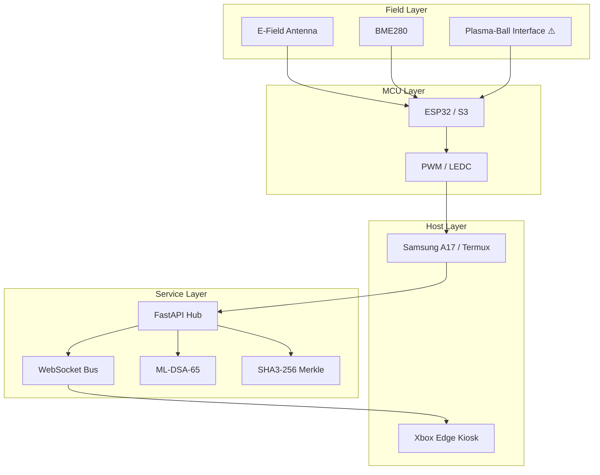
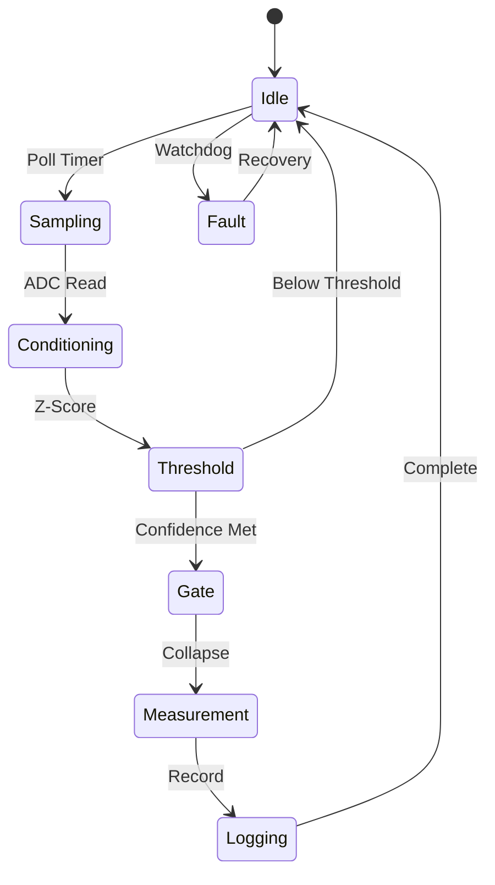

# Architecture and Data-Flow Extraction

**Source:** Mermaid templates in `pasted_content.txt`, lines 363–413  
**Related dossier:** `SOVEREIGN_EXTRACTION_REPORT.md`  
**Interpretation status:** **Specification/template extraction**, not evidence of an implemented or deployed system

## 1. Architecture at a glance

The source Mermaid architecture describes a four-layer northbound data path:

1. **Field Layer** acquires or drives physical phenomena.
2. **MCU Layer** reads field devices and applies pulse-width-modulation control.
3. **Host Layer** provides an operator/device surface through a Samsung A17 running Termux and an Xbox Edge kiosk.
4. **Service Layer** exposes a FastAPI hub, distributes events through a WebSocket bus, and applies integrity/authentication-related services labelled ML-DSA-65 and SHA3-256 Merkle.

The literal graph is:



The source does not specify whether arrows are analogue signals, digital messages, control commands, or logical relationships. The classifications below therefore distinguish **literal graph semantics** from **implementation details that remain unspecified**.

## 2. Layer and component specifications

### 2.1 Field Layer

| Node | Literal role implied by label | Direction in graph | Likely information class | Specification status |
| --- | --- | --- | --- | --- |
| `EF` — E-Field Antenna | Electric-field sensing element | `EF → ESP` | Electric-field measurement or event signal | Sensor model, range, bandwidth, analogue front end, sampling rate, calibration, and units are not specified. |
| `BME` — BME280 | Environmental sensor, conventionally associated with temperature, humidity, and pressure | `BME → ESP` | Environmental telemetry | Bus type, address, sample rate, compensation, precision, and wiring are not specified by the diagram. |
| `PB` — Plasma-Ball Interface | Plasma-ball-related interface, explicitly safety-marked | `PB → ESP` | Measurement and/or control interface associated with a plasma-ball device | Isolation, voltage/current limits, interface type, enclosure, interlocks, and safe operating procedure are not specified. Treat as safety-critical. |

**Field-layer boundary:** the diagram places all three field nodes as direct inputs to the ESP32/S3. It does not show signal conditioning, analogue-to-digital conversion, galvanic isolation, sensor power, common ground, shielding, or protective components. Those omissions are significant for any physical implementation.

### 2.2 MCU Layer

| Node | Literal role implied by label | Direction in graph | Required responsibility to make the graph operational | Not specified |
| --- | --- | --- | --- | --- |
| `ESP` — ESP32 / S3 | Embedded controller and field gateway | Receives `EF`, `BME`, `PB`; sends to `PWM` | Poll or receive field data; validate readings; timestamp samples; manage faults; emit host-facing telemetry or commands | Exact MCU variant, firmware, GPIO map, ADC configuration, buses, serial framing, packet schema, watchdog interval, power mode, and security boot state |
| `PWM` — PWM / LEDC | Pulse-width-modulation subsystem; LEDC is an ESP32 peripheral naming convention | `ESP → PWM → A17` | Generate or expose a PWM-controlled output and/or pass a PWM-derived signal onward | Channel, timer, frequency, duty-cycle range, output pin, load, direction, and whether the edge is telemetry or control are unspecified |

The `ESP → PWM → A17` chain is ambiguous. A literal reading suggests that the MCU produces a PWM/LEDC output which is delivered to the Samsung A17/Termux host. A phone generally does not accept a raw MCU PWM signal without a physical interface or protocol bridge. The diagram may instead mean that the host receives data about PWM state through a serial, USB, Bluetooth, Wi-Fi, or LAN bridge. No such bridge is drawn, so the transport must be treated as **not visible in source**.

### 2.3 Host Layer

| Node | Literal role implied by label | Direction in graph | Required responsibility to make the graph operational | Not specified |
| --- | --- | --- | --- | --- |
| `A17` — Samsung A17 / Termux | Mobile host running a Termux environment | Receives from `PWM`; sends to `API` | Act as local gateway, parser, client, operator interface, or protocol adapter; forward telemetry to the FastAPI hub | Exact device model, Android version, Termux packages, transport, authentication, local storage, offline behavior, and process supervision |
| `XBOX` — Xbox Edge Kiosk | Edge/browser kiosk display or operator endpoint | Receives from `WS` | Subscribe to WebSocket events and render dashboard or controls | Browser/runtime, kiosk security, origin policy, reconnection behavior, command permissions, and display schema |

The graph assigns the A17/Termux host an upstream gateway role and the Xbox kiosk a downstream presentation role. It does not show a return path from the kiosk to the API or MCU. Therefore, any interactive controls on the Xbox endpoint would be outside the literal graph unless an additional bidirectional route is added.

### 2.4 Service Layer

| Node | Literal role implied by label | Direction in graph | Required responsibility to make the graph operational | Not specified |
| --- | --- | --- | --- | --- |
| `API` — FastAPI Hub | HTTP/API service and central application hub | `A17 → API`; `API → WS`; `API → MLDSA`; `API → SHA3` | Receive host telemetry, validate/authenticate messages, persist or route events, expose API endpoints, and initiate integrity operations | Routes, methods, payload schemas, auth mechanism, persistence, rate limits, error model, versioning, deployment, and observability |
| `WS` — WebSocket Bus | Real-time event distribution layer | `API → WS → XBOX` | Publish telemetry/status events to connected kiosk clients | Topic names, message envelope, ordering, replay, backpressure, heartbeat, authentication, and reconnect policy |
| `MLDSA` — ML-DSA-65 | Post-quantum signature/authentication label | `API → MLDSA` | Sign or verify selected API artifacts or messages | Key ownership, algorithm parameter set, signing boundary, key storage, signature envelope, rotation, revocation, and verification failure behavior |
| `SHA3` — SHA3-256 Merkle | Hash/Merkle evidence-integrity label | `API → SHA3` | Hash records or batches and create a tamper-evident Merkle structure | Leaf canonicalisation, tree ordering, root publication, inclusion proofs, timestamping, storage, and verification process |

The graph shows one-way arrows from `API` to `MLDSA` and `SHA3`. It does not show return arrows carrying signatures, hashes, Merkle roots, or verification results back to the API. The safest interpretation is that these are logical service dependencies, not complete message flows.

## 3. End-to-end data flows

### Flow A — Field acquisition to MCU

The first three arrows are parallel acquisition paths:

```text
E-Field Antenna ─┐
BME280           ├──> ESP32 / S3
Plasma-Ball      ┘
```

The intended sequence is likely:

1. A field device produces a physical or environmental signal.
2. The ESP32/S3 samples or receives the signal.
3. Firmware associates the reading with a channel or sensor identity.
4. Firmware would normally apply validation, scaling, filtering, timestamping, and fault handling.
5. A structured MCU record would then be forwarded to the host layer.

Only step 2 is directly represented by the diagram. Steps 3–5 are required implementation responsibilities inferred from normal system design, not source-visible specifications.

### Flow B — MCU output through PWM/LEDC to mobile host

```text
ESP32 / S3 ──> PWM / LEDC ──> Samsung A17 / Termux
```

The diagram places the PWM/LEDC block between the MCU and the mobile host. Two interpretations are possible:

| Interpretation | Meaning | Evidence level |
| --- | --- | --- |
| Physical signal interpretation | The MCU emits a PWM waveform that is electrically received by the phone. | **HYPOTHESIS:** no interface hardware or phone input path is shown. |
| Logical telemetry interpretation | The MCU exposes PWM/LEDC state through a transport, and Termux receives a digital representation. | **HYPOTHESIS:** no serial, USB, Bluetooth, Wi-Fi, or LAN bridge is shown. |

Before implementation, the project must define the transport, voltage/current isolation, framing, sampling or event semantics, and failure behavior. The diagram alone does not establish any of these.

### Flow C — Mobile host to FastAPI hub

```text
Samsung A17 / Termux ──> FastAPI Hub
```

The graph makes the A17/Termux host the service ingress point. A complete implementation would need an ingress contract containing at least:

- source node and device identity;
- channel or signal identity;
- timestamp and clock source;
- value, unit, precision, and uncertainty;
- acquisition status and fault flags;
- firmware and protocol version;
- sequence number or idempotency key;
- authentication and integrity metadata;
- retry and offline-queue behavior.

None of these fields is defined by the Mermaid diagram. The pasted specification separately proposes a telemetry schema containing `channel_id`, `value`, `unit`, `precision`, `uncertainty`, `update_interval_ms`, `source_node`, `timestamp`, `status`, and an evidence seal. That schema is a template, not an observed API contract.

### Flow D — FastAPI hub to WebSocket bus to Xbox kiosk

```text
FastAPI Hub ──> WebSocket Bus ──> Xbox Edge Kiosk
```

This is the clearest real-time presentation path in the graph. The likely logical sequence is:

1. The API accepts or derives an event from the A17/Termux ingress.
2. The API validates the event and publishes a normalised message to the WebSocket bus.
3. The WebSocket bus fans the message out to one or more connected clients.
4. The Xbox kiosk receives the message and updates an edge dashboard.

The diagram does not show persistence, replay, event ordering, schema versioning, client authentication, or operator commands. The kiosk therefore has a **display-only role in the literal topology** unless a return path is added.

### Flow E — Integrity and authentication side flows

```text
FastAPI Hub ──> ML-DSA-65
FastAPI Hub ──> SHA3-256 Merkle
```

These are parallel service side flows, not downstream display flows. The diagram suggests that the API invokes cryptographic or integrity services, but it does not show what is signed or hashed. Candidate boundaries include:

- ingress telemetry envelopes;
- normalised events before WebSocket publication;
- audit-log records;
- exported JSON/PDF reports;
- firmware or configuration artifacts;
- Merkle roots over batches of evidence.

The source does not identify the boundary. No claim should be made that the API currently authenticates, signs, hashes, or seals any data.

## 4. Control state machine

The companion state diagram defines a cyclic acquisition-and-decision process:



### 4.1 State specifications

| State | Entry condition | Operation implied by label | Exit condition | Data produced or consumed |
| --- | --- | --- | --- | --- |
| `[*]` | System start | Initialise controller | `Idle` | Startup status; not otherwise specified |
| `Idle` | Initialisation, completed logging, or below-threshold rejection | Wait for the next poll or event | `Sampling` on `Poll Timer`; `Fault` on `Watchdog` | Timer state, health state |
| `Sampling` | Poll timer fires | Acquire a sensor reading | `Conditioning` on `ADC Read` | Raw ADC sample or sensor sample |
| `Conditioning` | ADC read completes | Condition/normalise signal | `Threshold` on `Z-Score` | Filtered or normalised value; baseline and variance are not specified |
| `Threshold` | Z-score is available | Compare signal against a confidence criterion | `Gate` on `Confidence Met`; `Idle` on `Below Threshold` | Decision flag; threshold, confidence definition, and hysteresis are unspecified |
| `Gate` | Confidence criterion met | Apply a gate or trigger a collapse/measurement cycle | `Measurement` on `Collapse` | Gate event; “collapse” is not technically defined |
| `Measurement` | Collapse transition completes | Perform the selected measurement | `Logging` on `Record` | Measurement result; method and units are unspecified |
| `Logging` | Measurement completes | Record result and audit event | `Idle` on `Complete` | Log record; storage and integrity seal are unspecified |
| `Fault` | Watchdog detects a failure from `Idle` | Recover or reset | `Idle` on `Recovery` | Fault code, reset reason, recovery count; not specified |

### 4.2 State-machine data flow

```text
Poll Timer
   ↓
Raw ADC Read
   ↓
Conditioning / normalisation
   ↓
Z-score calculation
   ↓
Confidence decision ── below threshold ──> Idle
   │
   └─ confidence met
          ↓
        Gate
          ↓
      “Collapse” transition
          ↓
      Measurement
          ↓
        Record
          ↓
       Logging
          ↓
         Idle
```

The watchdog is drawn as a separate transition from `Idle` to `Fault`. The diagram does not show watchdog transitions from `Sampling`, `Conditioning`, `Threshold`, `Gate`, `Measurement`, or `Logging`. That may be intentional, or it may be an incomplete safety model.

## 5. Proposed logical message boundaries

The following contracts are useful for implementation planning but are **not extracted values from the diagram**. They formalise the boundaries that the diagram leaves implicit.

### 5.1 Field sample envelope

```json
{
  "source_node": "esp32-s3-01",
  "channel_id": "bme280.temperature",
  "timestamp": "ISO-8601 timestamp",
  "sequence": 0,
  "value": 0.0,
  "unit": "degC",
  "precision": 2,
  "uncertainty": 0.0,
  "status": "LIVE|CALIBRATED|SIMULATED|PROTOTYPE|FAULT",
  "firmware_version": "version-or-hash",
  "fault_flags": [],
  "evidence_seal": null
}
```

### 5.2 API-normalised event

```json
{
  "event_id": "unique-id",
  "event_type": "telemetry|state|fault|control",
  "source_node": "esp32-s3-01",
  "received_at": "ISO-8601 timestamp",
  "payload": {},
  "schema_version": "1.0",
  "auth": {
    "algorithm": "ML-DSA-65|NOT_SPECIFIED",
    "signature": null
  },
  "integrity": {
    "algorithm": "SHA3-256|NOT_SPECIFIED",
    "leaf_hash": null,
    "merkle_root": null
  }
}
```

### 5.3 WebSocket publication envelope

```json
{
  "topic": "telemetry|state|fault|control",
  "event_id": "unique-id",
  "sequence": 0,
  "published_at": "ISO-8601 timestamp",
  "payload": {},
  "replayable": false
}
```

These envelopes make explicit the fields required to preserve traceability, ordering, and evidence status. They must not be represented as existing implementation unless corresponding code and tests are supplied.

## 6. Trust boundaries and security implications

The Mermaid graph crosses at least four trust boundaries:

1. **Physical field boundary:** uncontrolled or hazardous physical signals enter the embedded controller.
2. **Embedded-to-host boundary:** MCU output is transferred to a mobile device through an unspecified interface.
3. **Host-to-service boundary:** Termux submits data to the FastAPI hub over an unspecified network or local transport.
4. **Service-to-kiosk boundary:** WebSocket messages are delivered to an edge kiosk.

The ML-DSA-65 and SHA3-256 Merkle labels indicate intended integrity/security concerns, but the graph omits key management, TLS, authentication, authorisation, replay protection, and failure handling. The plasma-ball interface requires an additional electrical safety boundary with galvanic isolation and protective interlocks; the diagram does not show those components.

## 7. Timing, buffering, and failure semantics left unspecified

The architecture cannot be implemented reproducibly from the diagram alone because it omits:

- sensor polling intervals and ADC sample rates;
- PWM frequency, duty-cycle resolution, and update rate;
- MCU-to-phone transport latency and buffer size;
- API request limits, batching, retries, and offline queueing;
- WebSocket heartbeat, reconnect, replay, and backpressure policy;
- event ordering and duplicate handling;
- clock synchronisation across MCU, phone, API, and kiosk;
- watchdog timeout, recovery action, and fault escalation;
- threshold value, z-score window, baseline update rule, and hysteresis;
- measurement duration and logging durability;
- cryptographic signing and Merkle-sealing cadence.

All of these are **NOT VISIBLE IN SOURCE — DO NOT INFER**.

## 8. Extracted implementation requirements

If this diagram is used as a build specification, the minimum implementation records should be created before claiming completion:

| Area | Required record |
| --- | --- |
| Field devices | Sensor part numbers, electrical ranges, interfaces, isolation, calibration, environmental limits |
| MCU | Exact ESP32/S3 variant, firmware version, GPIO/pin map, ADC configuration, buses, watchdog, power modes |
| PWM/LEDC | Timer/channel/pin, frequency, duty range, polarity, load, safety limits, host transport semantics |
| A17/Termux | Device model, Android/Termux versions, process model, transport, local queue, authentication, storage |
| FastAPI | OpenAPI document, endpoints, auth, schemas, persistence, rate limits, error model, observability |
| WebSocket | Topics, envelopes, client auth, ordering, replay, heartbeat, reconnect, backpressure |
| Kiosk | Browser/runtime, allowed origins, display permissions, offline view, operator controls, update policy |
| ML-DSA-65 | Key generation, custody, signing boundary, verification, rotation, revocation, failure policy |
| SHA3-256 Merkle | Leaf format, canonicalisation, tree construction, root storage, inclusion proofs, verification |
| State machine | Formal transition table, thresholds, z-score window, baseline, hysteresis, fault transitions, test cases |
| Compliance | Electrical safety, EMC, thermal, privacy, consent, human-subjects, and security evidence |

## 9. Final interpretation

The Mermaid architecture is best read as a **conceptual reference topology** for a sensor-to-MCU-to-mobile-to-service-to-kiosk system with cryptographic side services. Its strongest explicit data path is:

```text
E-Field / BME280 / Plasma-Ball interface
        → ESP32 / S3
        → PWM / LEDC
        → Samsung A17 / Termux
        → FastAPI Hub
        → WebSocket Bus
        → Xbox Edge Kiosk
```

Its parallel integrity path is:

```text
FastAPI Hub → ML-DSA-65
FastAPI Hub → SHA3-256 Merkle
```

Its control path is a local cyclic state machine:

```text
Idle → Sampling → Conditioning → Threshold
  ├─ below threshold → Idle
  └─ confidence met → Gate → Measurement → Logging → Idle
Idle ── watchdog ──> Fault ── recovery ──> Idle
```

The graph does not provide enough information to claim a working implementation, a safe plasma interface, a validated biological measurement system, or a complete cryptographic evidence chain.

## References

[1]: /home/ubuntu/upload/pasted_content.txt "User-provided Mermaid architecture and control state-machine templates"

[2]: /home/ubuntu/work_bio_digital/SOVEREIGN_EXTRACTION_REPORT.md "Bio-digital sovereign extraction report"
