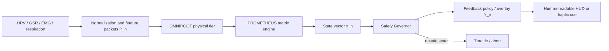
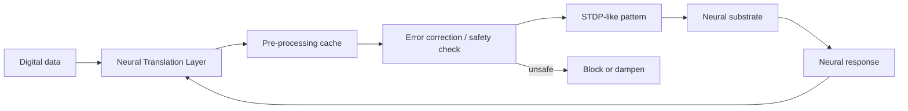
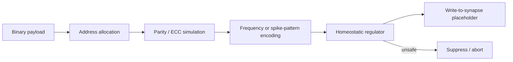
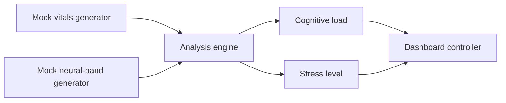
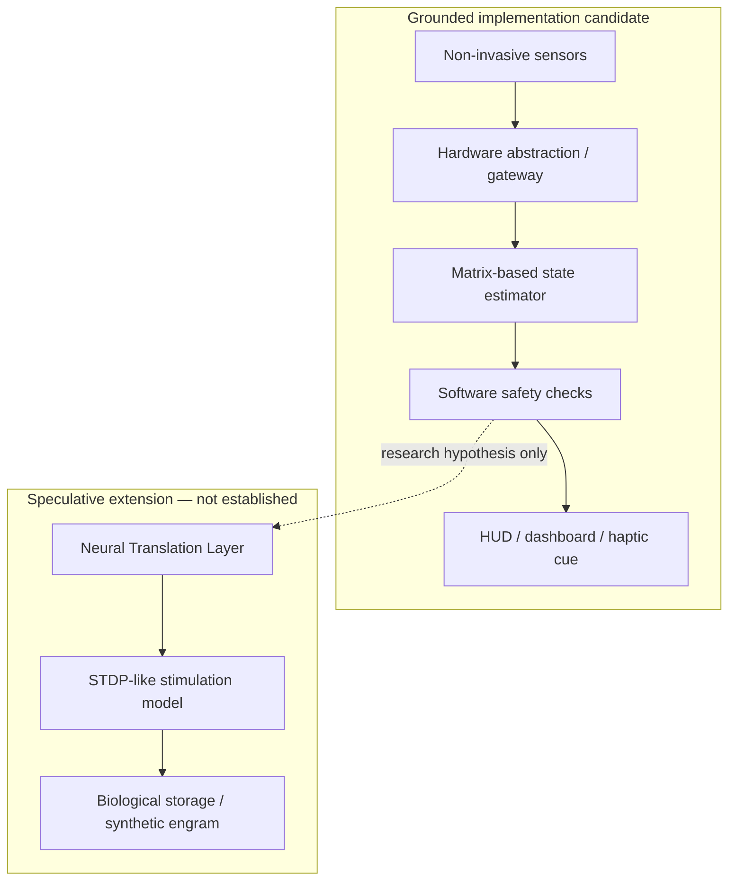

# Digital Human PDF Analysis

**Source document:** `⚡️Digital-Human(4).pdf`  
**Pages:** 129  
**Extracted text:** 6,088 lines  
**Embedded raster images:** None detected by `pdfimages -list`  
**Compared against:** 24 images from `bio-digital.zip`, the pasted Sovereign Extraction v4.0 specification, and the previous dossier  
**Prepared by:** Manus AI  
**Date:** 2026-09-22

## Executive finding

The PDF is a large conceptual design and simulation compendium. It combines real engineering vocabulary with speculative claims about direct neural data injection, cognitive firmware, biological data storage, neural rewriting, and genome-connectome causality. The code listings are useful as **illustrative simulation scaffolding** and as records of the proposed data flows, but they do not demonstrate a working medical, neural, robotic, or production system.

The image corpus and PDF are strongly thematically aligned. The PDF explicitly describes several supplied visuals as **conceptual**, **abstract**, or **AI-generated art**. That statement is important: the document itself supports classifying the brain-network renders, circuit overlays, humanoid robots, and NeuroScan screen as fictional or illustrative representations rather than as photographs of a deployed system.

The most defensible separation is:

| Classification | Meaning | Examples in this package |
| --- | --- | --- |
| **Source fact / non-fictional record** | The document or image genuinely contains the stated text, code, label, or visual element. | The PDF has 129 pages; the code listings exist as text; image 05 visibly displays `AX-7G`, `72 BPM`, `96%`, and `16 RPM`; image 21 visibly displays `SAMSUNG` and `A17`. |
| **Engineering-grounded concept** | A real technology or mathematical pattern is named, but the package does not prove this specific system implements it. | ESP32, Bluetooth Low Energy, I2C, SPI, FastAPI, PWA, HRV, GSR, state-space models, PID control, matrix multiplication, JSON contracts. |
| **Illustrative implementation / unverified** | Code or architecture is present, but it uses mocks, random values, placeholders, simplified thresholds, or no hardware integration. | `OMNIROOT_Interface`, `PROMETHEUS_Engine`, `SafetyGovernor`, NeuroScan controllers, WebSocket-style architecture, dashboard logic. |
| **Speculative / fictional** | The claim goes beyond evidence or describes a capability not established by the source. | Uploading digital code into a human cortex, storing external data in the brain, synthetic engrams, neural firmware updates, direct synaptic rewriting, and causal genotype-to-connectome optimisation. |

## 1. PDF contents and structure

The PDF contains a sequence of overlapping essays, architecture descriptions, code examples, and image-to-code interpretations rather than one internally versioned software specification. The main content families are as follows.

### 1.1 Neuro-cybernetic convergence and dynamical healing

The opening material describes a dual-process model: a subconscious or autonomous process manages homeostatic integrity, while a conscious process supplies intentional control. It then frames heart-rate variability (HRV), galvanic skin response (GSR), respiration, and related signals as inputs to a dynamical model of damage, inflammation, stress, fatigue, and recovery.

The document presents the state update:

```text
xₙ₊₁ = clip(Axₙ + Buₙ + Ezₙ + b − h · tanh(xₙ / d_thresh))
```

This is a legitimate form of a bounded nonlinear discrete-time state-space simulation. It is **not**, by itself, a validated model of tissue healing or a method for accelerating biological repair. The package contains no clinical dataset, parameter-identification procedure, prospective validation, comparator group, or clinical endpoint.

### 1.2 OMNIROOT hardware abstraction

OMNIROOT is described as a hardware abstraction layer with a sensory tier using I2C, SPI, and PCIe, a host tier, and loadable kernel modules. The intended role is to make physiological sensors appear as standardised system devices. The concept is compatible with ordinary systems engineering, but the PDF supplies no kernel module, device-tree configuration, hardware schematic, driver test, or sensor calibration record.

### 1.3 PROMETHEUS digital twin

PROMETHEUS is presented as a physiological state engine. The proposed state includes:

- `Dₙ`: damage burden;
- `Iₙ`: inflammation;
- `Sₙ`: stress or autonomic load;
- `Fₙ`: mental fatigue; and
- `Rₙ`: recovery reserve in the narrative model.

Several code versions reduce the state to four dimensions, commonly `[Damage, Inflammation, Stress, Fatigue]`. The implementation examples use identity or near-identity matrices, random matrices, arbitrary saturation constants, and synthetic sensor values. The “digital twin” is therefore a simulation object, not an empirically validated digital twin of a person.

### 1.4 Neuro-Digital Synthesis and cognitive firmware

This section makes the largest factuality transition. It describes high-density microelectrode arrays, single-neuron action-potential acquisition, decoding, spike-timing-dependent plasticity (STDP), and the bidirectional mapping of digital information into neural stimulation. It then describes “cognitive firmware” as digital code that can modulate neural pathways.

The PDF’s own code does not implement a neural interface. It maps arrays of numbers to thresholded values, timestamps, random values, or simple firing-rate-like numbers. The terms **STDP**, **neural syntax**, **cognitive firmware**, and **neural translation layer** are used as conceptual metaphors or simulation labels. No electrode hardware, stimulation waveform, charge-density limit, clinical protocol, biocompatibility evidence, or neural decoding validation is supplied.

### 1.5 Neural Architect and computationalist hypothesis

The document treats the brain as analogous to a digital computer or operating system. This is a philosophical and theoretical framing, not a demonstrated engineering equivalence. Biological neural systems are not shown to behave as a conventional binary computer, and the supplied images do not establish such an architecture.

### 1.6 Genomic and connectomic integration

The PDF proposes combining whole-genome sequencing, single-nucleotide polymorphisms, diffusion-weighted MRI, graph models, and neural connectivity density. Code examples create `GenomicData`, `ConnectomeData`, and synthesis classes, then correlate markers with graph weights.

The data structures are real programming constructs. The claim that they identify causal links between specific alleles and neural topology is **not established**. The examples use toy records such as `BDNF`, `APOE`, `Val66Met`, `e4`, `rs12345`, and synthetic graph weights. These are demonstration fixtures, not subject data or validated associations.

### 1.7 Neuro-cognitive data persistence and biological storage

Several sections describe external data being encoded into firing frequencies, pulse trains, synthetic engrams, or synaptic addresses. The proposed components include an encoding engine, storage controller, error-correction coding, bad-block or wear-level management, and a homeostatic scaling regulator.

This is the most clearly fictional or speculative subsystem. The source contains no mechanism for writing arbitrary external data into a human brain, no neural address space, no demonstrated storage capacity, no read-back protocol, and no evidence that Reed–Solomon-style parity or wear levelling maps to biological synapses. The code is a software metaphor for storage-system concepts.

### 1.8 BCI, humanoid, circuit, and NeuroScan image interpretations

The PDF repeatedly converts supplied visual concepts into class, module, and controller names. It explicitly says that the BCI images are “conceptual schematics” and “AI-generated art rather than actual technical documentation or existing codebases.” It similarly treats the humanoid imagery and NeuroScan visuals as prompts for simulations.

Those passages are useful for provenance. They confirm that the generated renders should not be treated as engineering drawings, medical scans, or evidence of a robotic platform.

### 1.9 Final Sovereign Human-Digital Interface blueprint

The closing blueprint consolidates the proposal into three tiers:

1. **Physical Tier:** OMNIROOT-style sensor acquisition for HRV and GSR.
2. **Client Tier:** local-first PWA running a matrix engine.
3. **Cloud Tier:** authoritative validation and CI/CD deployment of firmware updates.

It adds a Safety Governor, multi-omics integration, and a Neural Translation Layer. This is a coherent conceptual architecture, but the final document still does not include a complete deployable repository, interface contracts, tests, regulatory records, or validated human-subject evidence.

## 2. PDF-to-image matching

### 2.1 Dashboard images 01–03

The three `image_editor_*.jpg` dashboard images match the PDF’s Neuro-Digital Synthesis theme. The PDF discusses dashboards, matrix engines, neural metrics, synthesis status, system health, and real-time telemetry. The images visibly contain those design motifs.

The match is thematic and textual, not evidentiary. The PDF code does not demonstrate that the dashboard values were generated by a real sensor system. Values such as `98.7%`, `94.6%`, `2.48 TB/s`, `0.8 ms`, and `12.48M neural nodes` remain simulated display values. The PDF’s simplified algorithms cannot support the precision implied by the dashboards.

### 2.2 NeuroScan image 05

Image 05 is titled **NEUROSCAN INTERFACE v2.4.1** and displays `SUBJECT AX-7G`, `72 BPM`, `87%` brain activity, `96%` oxygen, `16 RPM`, regional percentages, frequency bands, `68%` cognitive load, and `32%` stress. The PDF contains several code variants that deliberately reproduce these visible values.

The strongest direct match is the JavaScript model:

```javascript
getVitals() {
    return {
        heartRate: 72,
        brainActivity: 87,
        oxygenLevel: 96,
        respiratoryRate: 16
    };
}
```

It also reproduces the frequency bands:

```javascript
alpha: '8-12 Hz',
beta: '12-30 Hz',
gamma: '30-100 Hz',
delta: '0.5-4 Hz',
theta: '4-8 Hz'
```

The Python version generates random values instead of reproducing the displayed record. The Java version uses other example frequencies such as alpha `10.5 Hz`, beta `20.0 Hz`, and gamma `50.0 Hz`. This confirms that the PDF is generating illustrative software representations from the image, not recovering a real telemetry source.

### 2.3 Humanoid robot images 04 and 20

The humanoid images match the PDF’s `AndroidController`, `AndroidCore`, `NeuralSystem`, `MechanicalActuatorInterface`, and `RobotNeuroscanSystem` concepts. The code creates synthetic identifiers, neural node arrays, connection densities, servo calibration messages, and actuator modules.

The visible renders do not provide actuator specifications, torque curves, joint limits, encoder data, safety-rated controls, battery architecture, or manufacturing drawings. The code therefore remains a conceptual control model.

### 2.4 Brain/network and circuit images 06–19 and 22–24

The brain and circuit renders match the PDF’s BCI, neural hub, neural network, DNA, and bio-digital circuit sections. The PDF maps visual nodes into software classes such as `NeuralHub`, `SystemModule`, `ConnectionNode`, `NeuralNetwork`, `DNASequence`, and `CircuitInterface`.

These classes are reasonable abstractions for a software demonstration. They do not prove that the decorative lines represent real circuits, that the nodes correspond to neurons, or that DNA has been encoded into a working neural interface. The PDF explicitly identifies the source visuals as conceptual or AI-generated.

### 2.5 Samsung A17 image 21

Image 21 visibly shows a Samsung wordmark and a large `A17` label on a phone screen. The PDF uses `Samsung_A17_Edge` and “Samsung A17” as a mobile edge-gateway concept. This is a direct visual-to-text association, not proof of a deployed A17 integration.

The PDF does not provide a verified handset model, Android build, Termux package list, USB/BLE/Wi-Fi transport, permissions, battery profile, or performance test. The phone image should be classified as **conceptual device reference**.

## 3. Extracted data flows

### 3.1 Biofeedback and digital-twin flow



The PDF proposes the following sequence: sensors produce physiological signals; the system normalises them into feature packets; the matrix engine computes the next state; the Safety Governor validates the state; and a feedback policy renders a cue. This is an implementable **monitoring and feedback concept** if limited to non-invasive sensing and carefully validated outputs.

What is not established is the mapping from state variables to actual health outcomes, the physiological meaning of arbitrary matrix parameters, or the safety of automated interventions.

### 3.2 Speculative neural-translation flow



The code implements only number-to-number transformations. The `R[Neural substrate]` step is not implemented by the package and must be classified as **speculative**. The feedback arrow does not demonstrate a functioning closed-loop neural interface.

### 3.3 Neuro-storage flow



The PDF’s code includes a mock address `ADDR_0xAF42`, a sample payload `[0x4A, 0x55, 0x53, 0x54]`, a base frequency of `20.0`, a five-hertz increment per set bit, and a PID regulator with `kp=0.1`, `ki=0.01`, and `kd=0.05`. These are exact source-code constants, but they are not biological specifications. They are simulation values.

### 3.4 NeuroScan flow



The Python implementation generates random values for heart rate, brain activity, oxygen, respiration, and spectral bands. It then derives cognitive load from `(gamma + beta) / (alpha + 0.1)` and stress from `(heart_rate / 150) * 100`. The script is therefore a deterministic **software demo only in structure**, not in output validity.

## 4. Factuality analysis by claim family

### 4.1 Non-fictional or engineering-grounded content

The following content is valid as a description of real concepts or as a record of what the PDF contains:

- HRV and GSR are real physiological signal categories.
- EMG and respiration are real biosignal categories.
- ESP32-class microcontrollers, BLE, I2C, SPI, PWAs, FastAPI, JSON, JavaScript, Python, and Java are real technologies.
- State-space equations, matrix-vector multiplication, clipping, hyperbolic tangent saturation, PID control, queues, caches, graph representations, and WebSocket-style event distribution are real software or mathematical patterns.
- Data minimisation, local processing, safety governors, auditability, consent, and human agency are legitimate engineering and governance requirements.
- The PDF genuinely contains code listings and named modules; it does not follow that those modules are built, tested, or connected to hardware.
- The supplied images genuinely contain the labels and visual elements transcribed in the previous dossier.

### 4.2 Valid concepts but unverified in this package

The following may be reasonable design goals, but require evidence before they are described as implemented:

- A physical tier that acquires HRV/GSR data through an ESP32 or Linux sensor stack.
- A local-first matrix engine running in a PWA.
- A cloud validation service and CI/CD pipeline.
- A FastAPI service, WebSocket bus, cryptographic sealing layer, or Samsung A17/Termux gateway.
- A NeuroScan dashboard backed by real sensors.
- A digital twin that tracks personal physiological state.
- A Safety Governor that can block unsafe software outputs.

### 4.3 Fictional or speculative content

The following claims exceed the supplied evidence and should be labelled **fictional/speculative** in any public or technical documentation:

- The human brain can be treated as a programmable storage medium for arbitrary external data.
- Digital code can be uploaded into a human mind as a firmware update.
- The Neural Translation Layer can rewrite synaptic weightings in a controlled subject.
- A software cache can prevent biological excitotoxicity during direct neural stimulation.
- Wear levelling, bad blocks, Reed–Solomon parity, or memory addresses map directly to biological synapses.
- Genomic markers can be used by this package to infer causal neural-connectome divergence.
- The system can accelerate tissue repair, suppress inflammation, or regenerate damaged tissue through conscious intent or a control vector.
- The source images show a real BCI, a real cyborg, a real NeuroScan system, or a certified robotic platform.
- Any displayed “LIVE”, “OPTIMAL”, “VERIFIED”, “SECURE”, “accuracy”, or “confidence” status proves the corresponding measurement or security property.

## 5. Critical code-level observations

The code listings themselves contain clear indicators of simulation status.

| Indicator | Examples | Consequence |
| --- | --- | --- |
| Random generation | `random.random()`, `random.uniform(...)`, `Math.random()` | Results are synthetic and non-reproducible unless seeded. |
| Placeholders | `return new double[data.length * 8]`, `ADDR_0xAF42`, “Implementation would interface…” | The claimed hardware or neural operation is not implemented. |
| Arbitrary thresholds | `0.8`, `0.85`, `0.7`, `80.0`, `20 Hz`, `d_thresh=10.0` | Constants are demonstration parameters, not validated safety limits. |
| Simplified heuristics | Stress derived from heart rate alone; cognitive load from band ratios | Not a validated clinical or physiological estimator. |
| Mock delay | `time.sleep(0.1)`, `setInterval(..., 1000)` | Simulates timing; does not establish real-time performance. |
| Incomplete execution | Missing imports, inconsistent class names, truncated snippets, raw generic Java collections | The listings are not a verified buildable production repository. |
| Narrative disclaimers | Phrases such as “simulates,” “conceptual,” “abstract,” “AI-generated art” | The PDF itself limits the evidence status. |

The repeated use of exact dashboard values in code is best interpreted as **visual reproduction**. It demonstrates that the code was written to mirror the image, not that the image was generated from the code or from a sensor.

## 6. Safety, privacy, and compliance boundary

The package contains human-like subject identifiers and health-style metrics. They must not be treated as a real clinical record. Any real deployment would require a consent model, privacy impact assessment, access control, retention and deletion rules, human-subjects oversight where applicable, clinical validation, and qualified safety review.

Direct neural stimulation or any attempt to write data into a biological nervous system would require a substantially higher safety and regulatory bar than the materials provide. The current package contains no electrode design, stimulation limits, charge-density calculations, isolation design, emergency disconnect, adverse-event protocol, or clinical trial evidence.

The “Safety Governor” is currently a software check over simulated arrays. It is not an independent safety instrument, a medical safeguard, or proof that a hazardous intervention can be made safe by thresholding a number.

## 7. Reconciled architecture

The factual and speculative portions can be documented together only if the boundary is explicit:



The left-hand path is a plausible software-and-sensor research architecture when used for observation and non-invasive feedback. The right-hand path is a fictional or unvalidated extension and must not be presented as a working capability.

## 8. Recommended documentation labels

For future versions, every module and diagram should carry one of the following labels:

- **Implemented and tested:** source repository, commit hash, test result, hardware identity, and reproducible run are supplied.
- **Simulation:** code runs over synthetic or mocked inputs and is not connected to a biological subject or production device.
- **Conceptual architecture:** intended interfaces and responsibilities are described, but code or hardware is incomplete.
- **Research hypothesis:** scientific or medical claim awaiting experimental validation.
- **Fictional visualisation:** image or narrative used to communicate an idea without asserting existence.

Applying these labels would preserve the useful engineering concepts while preventing speculative neural-storage and cognitive-firmware claims from being mistaken for established capabilities.

## 9. Final separation

### Non-fictional / supportable

The PDF exists and contains 129 pages of narrative and code. It presents recognisable software patterns, mathematical notation, sensor categories, embedded and web technologies, and explicit simulation modules. The image set exists and contains the previously transcribed dashboard text, the Samsung/A17 visual label, humanoid concepts, and brain/network/circuit imagery. The PDF-to-image matches are real as references and design inspirations.

### Fictional / speculative / not demonstrated

No evidence shows a functioning digital human, a validated digital twin, direct cortical data upload, biological data storage, synaptic firmware update, clinical NeuroScan device, real-time physiological healing controller, or causal genomics-connectomics engine. The images are not proof of those systems, and the code is not proof of those capabilities.

## References

[1]: /home/ubuntu/upload/⚡️Digital-Human(4).pdf "User-provided Digital Human PDF"

[2]: /home/ubuntu/work_bio_digital/pdf/Digital-Human-4.txt "Extracted text from the Digital Human PDF"

[3]: /home/ubuntu/work_bio_digital/SOVEREIGN_EXTRACTION_REPORT.md "Previous bio-digital image extraction dossier"

[4]: /home/ubuntu/work_bio_digital/ARCHITECTURE_DATA_FLOW_EXTRACTION.md "Mermaid architecture and data-flow extraction"

[5]: /home/ubuntu/upload/pasted_content.txt "User-provided Sovereign Extraction v4.0 specification"
