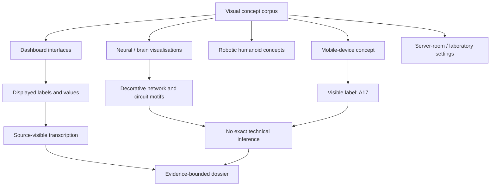

# Sovereign Extraction Report — Bio-Digital Image Set

**Revision:** 1.0.0  
**Prepared by:** Manus AI  
**Extraction date:** 2026-09-22  
**Source package:** `bio-digital.zip` containing 24 JPEG images  
**Controlling specification:** `pasted_content.txt`, *Sovereign Image Extraction Prompt v4.0 (Unified / Complete)*  
**Overall status:** **Illustrative visual corpus; source-visible values transcribed; implementation and compliance evidence not established**

> This dossier records what is visible in the supplied text and images. It does not convert artistic imagery into engineering fact. Values shown in dashboards are reproduced as displayed and are classified as **SIMULATED / UNVERIFIED** unless the source provides measurement provenance, calibration records, or test evidence.

## Executive conclusion

The corpus presents a coherent visual theme of neuro-digital synthesis: neural activity dashboards, brain/network visualisations, bio-digital interfaces, humanoid robotics, server-room environments, and a Samsung-branded phone concept containing the visible label `A17`. Five images are text-heavy dashboard interfaces. Nineteen images are predominantly conceptual renders or stylised visual compositions.

The corpus does **not** provide a verified hardware design, firmware implementation, source-code repository, bill of materials, pin map, electrical rating, calibration certificate, medical record, regulatory test report, cryptographic evidence seal, or machine-readable telemetry stream. The pasted specification defines those extraction targets and the required truth policy, but a requirement or template in that specification is not evidence that the corresponding implementation exists.

The most defensible technical interpretation is therefore a **concept and interface reference set**. The dashboards may be used to define candidate UI vocabulary and data-field names for a future implementation. Their numeric values must not be treated as live measurements, clinical observations, performance benchmarks, or regulatory claims.

## 1. Scope, method, and evidence policy

The analysis used the pasted v4.0 specification as the extraction schema. The specification asks for biological models, system architecture, dashboards, software and firmware, hardware bridges, telemetry, algorithms, regulatory records, and visual-render classification. The archive was enumerated, every image was reviewed, exact readable dashboard content was transcribed, and unreadable or decorative text was not reconstructed.

The following evidence labels are used throughout the dossier:

| Label | Meaning in this dossier |
| --- | --- |
| **VERIFIED** | Directly readable in a supplied source and reproduced without interpretation. This does not mean independently tested. |
| **SIMULATED** | A value, state, or interface displayed by an illustrative dashboard with no visible measurement provenance. |
| **HYPOTHESIS** | An interpretation or future research proposition. No hypothesis is promoted to a system fact here. |
| **UNVERIFIED** | Potentially meaningful, but lacking the source, method, or test evidence required to substantiate it. |
| **ESTIMATED** | Approximate or visually inferred information. It requires verification before engineering use. |
| **NOT VISIBLE** | The requested information is absent or not legible in the source. |

All image-level claims are bounded by the supplied pixels. Generated-looking images are classified as **Visual concept — not certified geometry**.

## 2. Source inventory and provenance

The archive contains five `image_editor_*.jpg` files at 1024 × 1536 pixels and nineteen `image_generator_*.jpg` files at 576 × 1024 pixels. SHA-256 hashes and exact dimensions are recorded in [`inventory.json`](inventory.json). The complete image-level observations are recorded in [`extraction_findings.md`](extraction_findings.md).

| Image group | Count | Dimensions | Primary content | Evidence status |
| --- | ---: | --- | --- | --- |
| Editor images | 5 | 1024 × 1536 | Three dashboard interfaces, one humanoid robot, one neuro-scan interface | Dashboard text is source-visible; values are simulated or unverified. |
| Generator images | 19 | 576 × 1024 | Brain/network concepts, server-room scenes, robotics, phone concept, circuit overlays | Visual concept; not certified geometry. |

The source package was supplied by the user. No external repository, commit hash, test log, device identifier, calibration record, or chain-of-custody metadata was included.

## 3. Biological and living-system models

The images use biological language and imagery, particularly *brain*, *neural activity*, *cognition*, *learning*, *memory*, *adaptation*, *brain regions*, *heart rate*, *oxygen level*, and *respiratory rate*. The following table separates visible labels from scientific or clinical claims.

| Source-visible element | What can be stated | Evidence boundary |
| --- | --- | --- |
| Neural activity, neural nodes, synapses, neural connectivity | These terms appear in dashboard labels or visual motifs. | **SIMULATED / UNVERIFIED:** no sensor modality, acquisition method, sampling rate, calibration, or ground truth is shown. |
| Brain-region percentages | The neuro-scan interface displays percentages for frontal, parietal, temporal, occipital, cerebellar, and brain-stem regions. | **SIMULATED / UNVERIFIED:** no imaging modality, segmentation method, normative baseline, or clinical interpretation is visible. |
| Heart rate, oxygen level, respiratory rate | The neuro-scan screen displays 72 BPM, 96%, and 16 RPM. | **SIMULATED / UNVERIFIED:** the image does not establish that these are measured from a person or that the units and method are clinically valid. |
| Genetics, biological interfaces, DNA imagery | Navigation and rendered imagery refer to genetics or show DNA. | **VISUAL CONCEPT:** no sequence data, assay, protocol, or biological measurement is visible. |
| Cognitive load and stress | The neuro-scan screen displays 68% cognitive load and 32% stress. | **SIMULATED / UNVERIFIED:** no validated psychometric or physiological model is provided. |

No consent record, privacy architecture, data-retention policy, de-identification method, human-subjects protocol, clinical approval, or non-interference protocol is visible. These items remain **NOT VISIBLE IN SOURCE — DO NOT INFER**.

## 4. Full system blueprint

The images support a source-level concept map, not a deployed architecture. The diagram below deliberately uses neutral evidence labels and does not assert that the depicted domains are connected in an implemented system.

### 4.1 Cross-domain mapping

| Domain | Visible representation | Permitted interpretation | Not established |
| --- | --- | --- | --- |
| Biological | Brain illustrations, neural terminology, DNA motif, physiological labels | The corpus communicates a bio-digital theme. | A biological signal pathway, organism model, physiological mechanism, or clinical capability. |
| Physical | Humanoid robot, laboratory, server-room, phone, circuit traces | The images use physical environments and device motifs as visual context. | Dimensions, materials, tolerances, electrical design, thermal performance, or manufacturability. |
| Digital | Dashboards, logs, status badges, data-stream labels, network diagrams | The corpus contains interface concepts and candidate data vocabulary. | A working application, API, storage system, runtime, or data source. |
| Quantum / advanced computing | “Quantum Optimizer” appears as a dashboard protocol label in image 03. | The phrase is a UI label. | Quantum hardware, quantum algorithm, quantum advantage, or validated optimizer implementation. |

### 4.2 Deployment topology

The pasted specification names potential targets such as Samsung A17/Termux, Xbox Edge kiosk, desktop browser, headless API, ESP32/S3, LAN hub, edge/Cloudflare, and offline/sandbox partitions. None of those deployment paths is demonstrated by the images. Device targets, IP addresses, ports, hostnames, environment variables, and network boundaries are **NOT VISIBLE IN SOURCE**.

## 5. Dashboard and interface specification

The dashboard screens provide the strongest source-visible technical content. The values below are transcribed exactly as displayed where legible. They remain **SIMULATED / UNVERIFIED** because the images show no source stream, uncertainty model, calibration record, or test evidence.

### 5.1 Dashboard image 01 — Neuro-Digital Synthesis

The screen is titled **NEURO-DIGITAL SYNTHESIS** and carries the subtitle **INTEGRATING INTELLIGENCE. AMPLIFYING POTENTIAL.** Its status is **OPTIMAL**. The visible time values are `14:27:36` and `UTC 07:27:36`.

| Interface area | Displayed content | Status |
| --- | --- | --- |
| Neural input | Signal quality `98.7%` | SIMULATED |
| Cognitive map | Memory index `92%`; focus level `88%`; learning rate `94%` | SIMULATED |
| Synthesis engine | `92% integration`; neural sync `ACTIVE`; data flow `OPTIMAL`; latency `2.7 ms` | SIMULATED |
| Data streams | Sensorium `100%`; knowledge base `96%`; external feed `89%`; context engine `94%`; predictive model `91%` | SIMULATED |
| Processing layers | Perception `100%`; analysis `97%`; abstraction `93%`; reasoning `95%`; synthesis `98%` | SIMULATED |
| Output synthesis | Confidence `96.2%`; accuracy `95.1%` | SIMULATED |
| Learning feedback | Model adaptation `+2.3%`; knowledge gain `+1.8%` | SIMULATED |
| State | Neural harmony `ACTIVE` | SIMULATED |
| Navigation | `OVERVIEW`, `ANALYSIS`, `LEARNING`, `PREDICTIONS`, `SETTINGS` | VERIFIED as visible labels |
| Lower panels | `ARCHITECTURE`; `ADAPTIVE INTELLIGENCE`; `EVOLVING`; `ADAPTING`; `ADVANCING` | VERIFIED as visible labels |
| Ethics protocol | Transparency `VERIFIED`; privacy `ENCRYPTED`; alignment `VERIFIED` | SIMULATED status labels |

The visible system log includes: `14:27:36 neural sync stable`, `14:27:35 data stream optimal`, `14:27:34 synthesis engine active`, `14:27:33 learning rate adjusted`, and `14:27:32 prediction updated`. The log continues with an ellipsis, so the remainder is **NOT VISIBLE**.

### 5.2 Dashboard image 02 — Neuro-Digital Synthesis

The screen is titled **NEURO-DIGITAL SYNTHESIS** and subtitled **INTEGRATING NEURAL INTELLIGENCE WITH DIGITAL SYSTEMS**. Its status is **OPERATIONAL**.

| Interface area | Displayed content | Status |
| --- | --- | --- |
| Neural activity | Global synchronization `82%`; signal strength `High` | SIMULATED |
| Learning | Learning rate `1.38x`; status `OPTIMAL` | SIMULATED |
| Node and integrity | Neural nodes `12,842`; system integrity `99.7%`; status `SECURE` | SIMULATED |
| Data streams | Total throughput `7.48 TB/s`; sensor feed `2.31 TB/s`; neural data `3.12 TB/s`; system logs `1.25 TB/s`; external input `0.80 TB/s` | SIMULATED |
| Core and engine | Neural synthesis core `ACTIVE`; synthesis engine `92% efficiency`; processing layers `7/7 online` | SIMULATED |
| Prediction | Predictive model `94.6% accuracy` | SIMULATED |
| Synthesis flow | `input → neural processing → synthesis → output` | VERIFIED as visible flow |
| Frequency monitor | Alpha `42.1 Hz`; beta `21.3 Hz`; gamma `63.8 Hz`; delta `3.7 Hz`; theta `6.1 Hz` | SIMULATED |
| System log | `10:24:32 neural link established`; `10:24:33 data synchronization complete`; `10:24:35 synthesis engine optimized`; `10:24:37 predictive model updated`; `10:24:39 all systems operational` | SIMULATED log |
| Session footer | Neural interface `CONNECTED`; session ID `NDS-7A3B-9F21`; uptime `24:17:56`; version `v2.4.1` | SIMULATED |

### 5.3 Dashboard image 03 — Neuro-Digital Synthesis

The title is **NEURO-DIGITAL SYNTHESIS** and the subtitle is **Bridging Neural Intelligence with Digital Innovation**. The screen displays `09:42:31` and `MAY 26, 2025`, with status **OPTIMAL**.

| Interface area | Displayed content | Status |
| --- | --- | --- |
| Navigation | `OVERVIEW`, `NEURAL MAP`, `SYNTHESIS`, `DATA STREAMS`, `ANALYTICS`, `MODELS`, `INTEGRATION`, `SECURITY` | VERIFIED as visible labels |
| Neural activity | `REAL-TIME VISUALIZATION`; `LIVE` | SIMULATED status label |
| Synthesis engine | Processing `87%`; cycle `7,842` | SIMULATED |
| Neural states | Cognition `92%`; learning `88%`; memory `79%`; adaptation `93%`; focus `85%` | SIMULATED |
| Neural link | `CONNECTED`; signal strength `98.7%`; data throughput `2.48 TB/s` | SIMULATED |
| Synthesis output | Quality index `94.3%` | SIMULATED |
| Active protocols | `Neuro-Link v3.2`; `Adaptive Learning AI`; `Cognitive Mesh Sync`; `Data Fusion Engine`; `Quantum Optimizer` | SIMULATED labels |
| Data streams | Neural nodes `12.48M`; synapses `86.32B`; signals/sec `4.29M`; latency `0.8 ms`; `LIVE FEED` | SIMULATED |
| Health and uptime | System health `100%`; uptime `127d 14h 32m` | SIMULATED |
| Console | `system online and optimized`; `neural link established`; `synthesis engine engaged`; `ready for input` | SIMULATED log |

The date is an in-image display value and is not the extraction date. The dashboard does not expose the meaning of `M`, `B`, the calculation method for quality or health, or the source of the frequency and throughput values.

### 5.4 Neuro-scan interface image 05

The screen is titled **NEUROSCAN INTERFACE v2.4.1**, with mode **LIVE ANALYSIS** and system status **ONLINE**. It shows a subject block, but the presence of a subject ID in an illustrative image does not make the image a medical record.

| Interface area | Displayed content | Status |
| --- | --- | --- |
| Subject | `SUBJECT AX-7G`; ID `7G-842-19`; age `29`; scan `05/31/2024` | SIMULATED / PRIVACY-SENSITIVE UI content |
| Scan | Progress `78%`; estimated completion `00:02:14` | SIMULATED |
| Vitals | Heart rate `72 BPM`; brain activity `87%`; oxygen level `96%`; respiratory rate `16 RPM` | SIMULATED / UNVERIFIED |
| Brain regions | Frontal lobe `82%`; parietal lobe `70%`; temporal lobe `67%`; occipital lobe `71%`; cerebellum `85%`; brain stem `90%` | SIMULATED / UNVERIFIED |
| Frequency bands | Alpha `8–12 Hz`; beta `12–30 Hz`; gamma `30–100 Hz`; delta `0.5–4 Hz`; theta `4–8 Hz`; `FULL SPECTRUM` | SIMULATED labels |
| Cognitive and stress | Cognitive load `68%`; status `OPTIMAL`; stress `32%`; status `LOW` | SIMULATED / UNVERIFIED |
| Connectivity | Legend: `strong`, `moderate`, `weak` | SIMULATED legend |
| Navigation | `overview`, `activity`, `networks`, `genetics`, `analytics`, `reports`, `settings` | VERIFIED as visible labels |
| Controls | `rotate`, `zoom`, `pause`, `reset view`, `export data` | VERIFIED as visible labels |

No consent, subject provenance, clinical validation, measurement method, retention policy, or access-control model is visible. The displayed subject identifiers should be treated as fictional or illustrative test data.

## 6. Software, firmware, services, and data schemas

The pasted specification requests complete, runnable firmware and software blocks. No source code is visible in the image set. The following items are therefore **NOT VISIBLE IN SOURCE — DO NOT INFER**:

- ESP32/S3 code, GPIO assignments, PWM/LEDC timings, serial framing, checksums, watchdog logic, sensor polling, and power modes.
- Python, NumPy, SciPy, FastAPI, TypeScript, React, Vite, C++, or other implementation files.
- API routes, WebSocket topics, event-bus messages, authentication, Merkle-tree generation, ML-DSA-65 signing, or SHA3-256 evidence seals.
- Environment variables, configuration files, dependency manifests, CI/CD gates, test harnesses, worker orchestration, and deployment manifests.
- A machine-readable telemetry record with channel ID, value, unit, precision, uncertainty, update interval, source node, timestamp, and evidence seal.

The only source-visible software-like elements are UI labels such as `v2.4.1`, `Neuro-Link v3.2`, `Adaptive Learning AI`, and the session ID `NDS-7A3B-9F21`. They are interface text, not evidence of executable software or an API contract.

## 7. Controllers, hardware, and physical layer

The images show visual motifs of circuit traces, sensors, network nodes, laboratory tables, a smartphone, and humanoid robots. These motifs do not expose a reliable bill of materials or electrical design.

| Requested engineering record | Result |
| --- | --- |
| GPIO and pin map | Not visible in source. |
| Sensor part numbers and ranges | Not visible in source. |
| HV/plasma circuit, MOSFET isolation, creepage, clearance | Not visible in source. |
| PCB stackup, trace widths, copper weight, impedance | Not visible in source. |
| Enclosure dimensions, material grade, IP rating, fasteners | Not visible in source. |
| Thermal limits, airflow, dissipation, surface temperature | Not visible in source. |
| BOM designators, manufacturer part numbers, footprints, suppliers | Not visible in source. |
| Wiring diagrams and connector pinouts | Not visible in source. |
| Firmware-to-hardware bridge | Not visible in source. |

The humanoid images may be classified as **prototype/concept visuals**, but no as-built or verified-design status can be established. The visible Samsung wordmark and `A17` label in image 21 are source-visible visual elements only; the image does not establish a model number, chipset, operating system, or integration.

## 8. Algorithms and novel patterns

The pasted specification names candidate concepts such as coherence, entropy, superposition/collapse modelling, resonance equations, calibration of the form `y = m·x + b`, Bonferroni-style correction, SPSA, genetic algorithms, drift tracking, multi-agent consensus, DUP, Photonic-Ω coherence, ForeverChain, 5D sonar/geometry transforms, and engram/signal memory routing. None of these algorithms is implemented or mathematically specified in the images.

The dashboards display derived-sounding metrics such as confidence, accuracy, integration, focus, adaptation, quality, health, learning rate, cognitive load, and stress. No equation, feature definition, sample window, training set, threshold, uncertainty, or validation result is visible. Therefore:

1. The values are recorded as **displayed UI values**.
2. Their computation is **NOT VISIBLE IN SOURCE**.
3. No novel pattern is claimed as verified.
4. No biological or quantum mechanism is inferred from visual metaphor.

A future implementation may create a claims register using the pasted template, but this archive alone cannot populate a verified claims register.

## 9. Regulatory, safety, privacy, and compliance record

No declaration of conformity, test summary, responsible legal entity, issue date, device class, environmental rating, hazardous-zone classification, insulation category, leakage limit, dielectric-strength result, RF emission result, immunity result, thermal test, calibration date, or firmware hash is visible.

The following controls are required before any physical, biological, clinical, or safety-critical deployment, but they are not evidenced by the supplied images:

| Risk area | Minimum evidence required before deployment | Current status |
| --- | --- | --- |
| Biological or human-subject use | Consent, ethics review where applicable, privacy controls, data minimisation, retention and deletion rules | Not visible; do not infer. |
| Health-like outputs | Validated measurement method, clinical or domain validation, uncertainty, intended-use boundary, qualified review | Not visible; do not treat as medical data. |
| Electrical and HV systems | Isolation design, creepage/clearance, protective enclosure, current limiting, test records, qualified review | Not visible; no wiring should be inferred. |
| Network and identity | Authentication, authorisation, transport protection, audit logs, key management, threat model | Not visible. |
| Integrity claims | Reproducible hashes, signed artifacts, key custody, verification procedure, timestamped evidence | Not visible. |
| Regulatory conformity | Applicable standards, test plan, test reports, responsible entity, revision control | Not visible. |

The pasted specification specifically warns that high-voltage or plasma systems must not be wired directly and require isolation and appropriate creepage/clearance. That is a safety requirement in the controlling text, not evidence that the pictured system contains such hardware.

## 10. Integration references and missing links

The pasted specification names repositories and paths including `sovereign-reaction-network`, `xbox-qpu`, `invisible-pressure-platform`, `sovereign-ai-commons-bridge (SACB)`, `cosmic_camera`, `XboxDigitalTwin`, and `deepseek-v4-sovereign`. No repository contents, commit hashes, branch names, or integration artifacts were supplied with the archive.

| Proposed integration area from pasted specification | Image evidence | Current conclusion |
| --- | --- | --- |
| Sensor calibration and telemetry | Dashboard-style values and status labels | Candidate UI vocabulary only; no sensor source or calibration. |
| Pinouts, serial frames, PWM | Circuit and device motifs | No pin or protocol evidence. |
| BOM and manufacturing | Robot and laboratory renders | Concept visual only; no manufacturing record. |
| Integrity seals and traceability | “Secure”, “verified”, and session labels | UI status text only; no cryptographic proof. |
| Vision and optical sensing | Brain/network imagery | No camera specification or optical pipeline. |
| Digital twin profiles | Humanoid and mobile concepts | No profile schema or export file. |
| Biological models and engram routing | Neural terminology and brain visuals | No model, code, or validated biological mapping. |
| Compliance and claims register | Pasted templates | Templates are present; completed records are not. |

## 11. Image-by-image visual catalogue

The following catalogue covers all 24 images. It is intentionally concise where images contain no reliable text.

| # | Source file | Extracted content and boundary |
| ---: | --- | --- |
| 01 | `image_editor_4fc2e1b6-40d6-4743-8bab-441f4ce8ecac.jpg` | Neuro-Digital Synthesis dashboard; exact labels and values transcribed in §5.1. Simulated interface. |
| 02 | `image_editor_5a1c3186-8d2a-4bbb-abe7-20c168a22d74.jpg` | Neuro-Digital Synthesis dashboard; exact labels and values transcribed in §5.2. Simulated interface. |
| 03 | `image_editor_6d274a1d-3e7e-410b-b82f-3d7a4a7fa89e.jpg` | Neuro-Digital Synthesis dashboard; exact labels and values transcribed in §5.3. Simulated interface; in-image date `MAY 26, 2025`. |
| 04 | `image_editor_6280f0f6-1cb6-46ba-a2d2-5f614166379a.jpg` | Humanoid robot in laboratory; no technical labels, dimensions, or ratings. Visual concept. |
| 05 | `image_editor_707342f5-1e70-48bb-97f4-8f7277ac018c (1).jpg` | NeuroScan Interface v2.4.1; exact displayed subject, vitals, regions, bands, controls transcribed in §5.4. Simulated and privacy-sensitive. |
| 06 | `image_generator_0ab070ee-651d-4be2-9406-6989b3c48bff.jpg` | Wall-mounted neural dashboard; visible large value `2.30%`, surrounding text not reliably legible. Concept visual. |
| 07 | `image_generator_13849a1e-8df7-48fc-a890-e997bf325518.jpg` | Blue/magenta left-facing head with neural network and circuit traces; no legible text. |
| 08 | `image_generator_1bd7486f-b9a5-4402-ac55-8e7dc9731662.jpg` | Blue brain with network points and DNA helix; no legible text. |
| 09 | `image_generator_228e67a6-ab69-4c35-ba75-d20b089a9e58.jpg` | Orange/red glowing brain in laboratory corridor; no legible text. |
| 10 | `image_generator_2a8f8cf3-4c72-4b81-8686-38bbfbcae085 (1).jpg` | Blue brain over circuit-diagram background; decorative schematic marks not legible enough for exact extraction. |
| 11 | `image_generator_47964fe7-75e3-421b-bc9e-ebedb1dc960b.jpg` | Abstract glowing circuit traces in corridor; no legible text. |
| 12 | `image_generator_5511e5a5-a9e8-4333-857d-d552fce07cbe.jpg` | Semi-transparent head with luminous brain/network and lab background; no legible text. |
| 13 | `image_generator_5d7062b6-16f2-414b-972d-dd1e2213a99d.jpg` | Floating blue/orange brain with background data-like streams; streams not reliably readable. |
| 14 | `image_generator_60f39bd1-523a-463a-bec0-fa41dbd9acba.jpg` | Brain above engineering table with charts and small device; no legible text. |
| 15 | `image_generator_73c044dc-9baf-463c-a5cf-19be63367926.jpg` | Floating cyan brain connected to four glowing base nodes; no labels. |
| 16 | `image_generator_7aaff376-9535-42fb-be4d-c2d69f9db03e.jpg` | Translucent brain with pink/cyan network in a lab; no labels. |
| 17 | `image_generator_c02cad3c-1aff-4ad6-bd7b-dce0464d72e9.jpg` | White luminous brain/network in glass corridor; no labels. |
| 18 | `image_generator_c1e30123-c084-4b4c-b510-9a1812c15be7.jpg` | Small brain at centre of a branching network in server room; no labels. |
| 19 | `image_generator_cfbfc3e1-b872-4cf0-9dd1-87fc7e6b11b8.jpg` | Close-up brain with circuit traces and small schematic icons; icons not legible. |
| 20 | `image_generator_d4ad583e-4e43-4712-862b-7cb01cd310f1.jpg` | Humanoid robotic head with metallic shell, actuator, cabling, eye, and facial panels; no ratings or part numbers. |
| 21 | `image_generator_db72661a-87a6-4b7c-810a-be37657d3ec7.jpg` | Samsung-branded phone on engineering drawing; `A17` and `SAMSUNG` visible; small circuit labels not legible. |
| 22 | `image_generator_e38dcb80-83d6-45cc-8290-8e407121c24e.jpg` | Red/cyan floating brain in server corridor; no legible text. |
| 23 | `image_generator_f1bc70c2-5306-451a-8ed2-ad4a4f710476.jpg` | Blue technical composition with brain, circuit traces, peripheral modules, and displays; faint marks not reliably readable. |
| 24 | `image_generator_f46b0727-a005-4430-a7af-7359e2f60c14.jpg` | Human-like profile with orange circuit traces mapped across head and face; no legible text. |

## 12. Validity and boundary declaration

The source-visible dashboard text is transcribed with **VERIFIED transcription status** but its underlying values are **SIMULATED / UNVERIFIED**. The generated renders are **VISUAL CONCEPTS — NOT CERTIFIED GEOMETRY**. No code, firmware, hardware interface, safety test, medical measurement, regulatory submission, cryptographic seal, or real-time telemetry feed is established by this corpus.

The following distinctions are mandatory for any downstream use:

- A displayed percentage is not a measured percentage unless acquisition, calibration, uncertainty, and validation are supplied.
- A status badge such as `VERIFIED`, `SECURE`, `OPTIMAL`, or `LIVE` is not independent verification.
- A circuit-like drawing is not a schematic unless component designators, connectivity, values, and revision metadata are available.
- A brain visualisation is not a biological model or neural recording.
- A subject ID and vital signs in a rendered UI are not a medical record.
- A protocol name is not an implementation.
- A phone label is not a device specification.

## 13. Recommended next evidence package

To promote this dossier from an illustrative extraction to an engineering or compliance dossier, the next package should include the original design sources rather than screenshots alone. Required artifacts are a repository snapshot with commit hashes; source code and dependency manifests; hardware schematics, PCB files, BOM, and pin maps; calibration procedures and raw measurements; telemetry samples with timestamps and uncertainty; threat model and key-management records; human-subjects and privacy documents where applicable; electrical, EMC, thermal, and environmental test reports; and a signed revision-controlled claims register.

Until those artifacts exist, the safe status of the corpus is **conceptual reference material for interface and visual design**, not an operational, clinical, or compliance-certified system.

## References

[1]: pasted_content.txt "Sovereign Image Extraction Prompt v4.0 — user-provided controlling specification"

[2]: inventory.json "Bio-digital image inventory with dimensions and SHA-256 hashes"

[3]: extraction_findings.md "Image-by-image extraction notes and evidence boundaries"

[4]: bio-digital.zip "User-provided source image archive"
