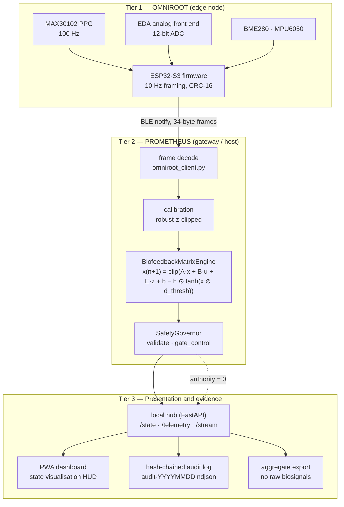
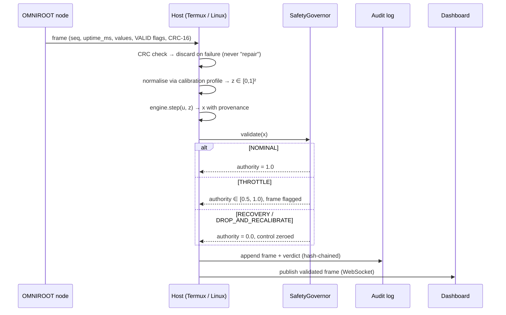

# Architecture

Version 2.5.0 · Evidence labels per section · See `EVIDENCE_LABELS.md` for definitions.

---

## 1. Tiered stack



| Tier | Evidence label | Notes |
| --- | --- | --- |
| 1 — OMNIROOT | `CONCEPTUAL_ARCHITECTURE` | Framing/CRC implemented and tested natively and on host; sensor paths not bench-validated |
| 2 — PROMETHEUS | `IMPLEMENTED_AND_TESTED` (mechanism) / `SIMULATED` (meaning) | The numerical behaviour is verified; the *physiological interpretation* is not |
| 3 — Presentation | `IMPLEMENTED_AND_TESTED` | Local hub, PWA, audit chain and aggregate export all have automated tests |

**Positive statement of scope.** The system acquires, normalises, estimates, gates, displays and
records. There is no actuator path anywhere in the stack: no stimulation output, no dosing, no
closed-loop intervention into a person. The only "closed loop" is the loop between the user and a
displayed cue.

---

## 2. Data flow and trust boundary



Trust boundary: **the host is trusted, the network is not.** Frames arriving from a node are
validated for framing, CRC, channel ranges, sequence window and capture time before they are used.
Nothing from a node can set a control value — control is accepted only through the authenticated
`POST /api/v1/control` endpoint, which the operator (a human) calls.

---

## 3. State model

`software/sovereign_hdi/prometheus_engine.py`

```
x(n+1) = clip( A·(x(n) − x_ref) + x_ref + B·u(n) + E·z(n) + b − h ⊙ tanh(x(n) ⊘ d_thresh) )
```

| Symbol | Shape | Shipped value | Meaning |
| --- | --- | --- | --- |
| `x` | 5×1 | `[0.15, 0.15, 0.25, 0.25, 0.75]` at rest | damage, inflammation, stress, fatigue, reserve — unitless indices in `[0,1]` |
| `A` | 5×5 | `0.95·I` + small coupling | decay toward `x_ref` plus cross-channel coupling |
| `B` | 5×1 | `[-0.05, -0.10, -0.20, -0.05, +0.08]` | user-mediated intent: lowers load, raises reserve |
| `E` | 5×2 | `[[0.01,0.02],[0.01,0.01],[0.05,0.02],[0.02,0.01],[0,0]]` | normalised sensor deviation influence |
| `h` | 5×1 | `0.02` | saturation gain — bounds the per-step saturation term |
| `d_thresh` | 5×1 | `10.0` | saturation length scale |
| `clip` | — | `[0, 1]` | hard per-channel bound |

### 3.1 Three corrections to the source specification

These are engineering fixes, recorded because they change model behaviour and a reviewer must know
why the shipped model differs from the original narrative.

1. **`B` dimension.** The source wrote `B` as a 1×5 row and transposed it at construction, which
   cannot multiply a scalar control into a 5-vector. It is stored as 5×1 (rows = state channels),
   so `B @ u` yields a 5-vector.
2. **Decay target.** The source decayed `x` toward the zero vector. With a `MIN_RESERVE` floor of
   `0.20`, that drives `reserve → 0` in open loop and permanently trips the governor: the loop is
   unrecoverable by design. The shipped model decays `(x − x_ref)` toward a homeostatic setpoint, so
   open-loop behaviour is bounded, testable and recoverable
   (`tests/unit/test_prometheus_engine.py::test_open_loop_converges_inside_bounds`).
3. **Cross-channel coupling.** `A` includes small coupling terms (e.g. `inflammation → stress`)
   because a diagonal matrix cannot express the "dynamical" part of the original claim. Setting them
   to `0.0` recovers strictly diagonal behaviour.

### 3.2 Determinism

Parameters are loaded from `config/default_model.json`, never generated at runtime. There is no
`np.random` anywhere in the engine. `tests/unit/test_deterministic_replay.py` asserts byte-identical
trajectories across runs, and `test_linalg.py` asserts the NumPy and pure-stdlib paths agree to 1e-12.

---

## 4. Module map

| Module | Responsibility | Evidence label |
| --- | --- | --- |
| `linalg.py` | Tiny vector/matrix algebra; optional NumPy | `IMPLEMENTED_AND_TESTED` |
| `config.py` | Frozen, versioned, validated model configuration | `IMPLEMENTED_AND_TESTED` |
| `prometheus_engine.py` | Bounded non-linear state engine | `IMPLEMENTED_AND_TESTED` (mechanism) |
| `safety_governor.py` | Numerical + state gates, control authority | `IMPLEMENTED_AND_TESTED` |
| `calibration.py` | Baseline capture, documented normalisation | `IMPLEMENTED_AND_TESTED` |
| `omniroot_client.py` | Frame contract, CRC, transports | `IMPLEMENTED_AND_TESTED` (Replay) / `CONCEPTUAL_ARCHITECTURE` (BLE, Serial) |
| `telemetry_schema.py` | Enforceable `telemetry.v1` envelope + JSON Schema | `IMPLEMENTED_AND_TESTED` |
| `sealing.py` | SHA3-256 seals and hash chaining | `IMPLEMENTED_AND_TESTED` |
| `telemetry/writer.py` | Hash-chained NDJSON audit log | `IMPLEMENTED_AND_TESTED` |
| `telemetry/export.py` | Aggregate-only export | `IMPLEMENTED_AND_TESTED` |
| `api/state_store.py` | Ingest contract, dedupe, quarantine, fan-out | `IMPLEMENTED_AND_TESTED` |
| `api/app.py` | Local hub HTTP/WS surface | `IMPLEMENTED_AND_TESTED` |
| `simulation/` | Deterministic synthetic physiology | `SIMULATED` |
| `stability.py` | Four-regime numerical stability sweep | `IMPLEMENTED_AND_TESTED` |
| `dashboard/` | React/Vite visualisation PWA | `IMPLEMENTED_AND_TESTED` |

---

## 5. Performance budget

| Property | Target | Where it is checked |
| --- | --- | --- |
| Frame cadence | 10 Hz (100 ms) | `HDI_SAMPLE_INTERVAL_MS`, absolute-deadline loop in `main.c` |
| Frame size | 34 bytes fixed | `_Static_assert` (C) and `FRAME_SIZE` (Python) |
| Engine step | ≪ 1 ms (5×5 algebra) | `stability.py` reports duration for 10 000 iterations |
| State update rate | 10 Hz continuous | hub `HDI_ENGINE_HZ` |
| Numerical stability | 0 non-finite, 0 bound violations | `stability.py`, four regimes |
| Battery (node) | > 7 days at 1 min cadence | **Not measured** — see `LIMITATIONS.md` §4 |

The latency target in the source blueprint (`< 50 ms` BLE round-trip) is **not** asserted here: no
BLE measurement was taken, so claiming it would be fabrication. What *is* asserted is that the
processing path is deterministic and bounded, and that timing is measured rather than assumed.
