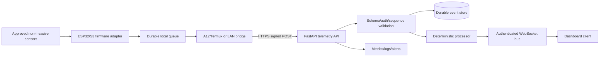

# Bio-Digital Telemetry Platform
## Development and Deployment Documentation Blueprint

**Document status:** Reference implementation blueprint  
**Revision:** 1.0.0  
**Scope:** Non-invasive telemetry ingestion, deterministic biofeedback processing, dashboard delivery, and ESP32 gateway integration  
**Audience:** Developers, firmware engineers, DevOps engineers, security reviewers, QA engineers, and technical operators

> This blueprint describes a production-oriented software and telemetry platform. It does not implement neural stimulation, direct cortical data upload, biological data storage, medical diagnosis, treatment, high-voltage control, or autonomous biological intervention.

## 1. Purpose and objectives

The platform provides a controlled path from approved non-invasive sensors to a validated telemetry API, deterministic signal-processing services, and dashboard events. Its primary objectives are to preserve data provenance, prevent duplicate or replayed messages, make failure behaviour explicit, keep simulations reproducible, and ensure that operational dashboards distinguish live, calibrated, simulated, and prototype data.

The system is designed to replace an earlier conceptual ESP32-to-FastAPI diagram with a versioned contract and explicit communication protocol.

## 2. System architecture



### 2.1 Component responsibilities

| Component | Responsibilities | Explicit exclusions |
| --- | --- | --- |
| Sensor adapters | Acquire approved sensor readings, provide calibration and quality metadata | No interpretation or intervention |
| ESP32/S3 firmware | Sampling, validation, timestamps, sequence numbers, watchdog, offline queue | No neural stimulation or hazardous actuation |
| Mobile/LAN bridge | Transport adaptation, signing, retry, replay of queued records | No silent mutation of values |
| FastAPI API | Authentication, schema validation, sequence handling, idempotent ingestion, persistence, publication | No unsupported clinical conclusions |
| Processor | Versioned, deterministic, bounded feature calculations | No diagnosis or treatment decisions |
| WebSocket bus | Deliver validated dashboard events with ordering and reconnect support | No unaudited control path |
| Dashboard | Display values, units, timestamps, quality, provenance, and stale-data status | No claims that simulated data is live |
| Operations | Deployment, monitoring, secret rotation, backup, incident response | No bypass of validation gates |

## 3. Repository structure

```text
reference_implementation/
├── contracts/
│   ├── telemetry.schema.json
│   └── PROTOCOL.md
├── backend/
│   └── app/
│       ├── main.py
│       ├── models.py
│       ├── processing.py
│       ├── security.py
│       └── store.py
├── simulations/
│   ├── python/
│   │   ├── simulator.py
│   │   └── client.py
│   └── javascript/
│       ├── biofeedback.js
│       ├── telemetry_client.js
│       └── test.js
├── firmware/esp32/
│   ├── telemetry_contract.h
│   └── README.md
├── hardware/
│   └── COMMISSIONING.md
├── tests/
│   └── test_backend.py
├── deploy/
│   ├── Dockerfile
│   ├── docker-compose.yml
│   └── .env.example
├── docs/
│   ├── DEVELOPMENT_DEPLOYMENT_BLUEPRINT.md
│   └── PRODUCTION_BLUEPRINT.md
├── requirements.txt
├── Makefile
└── README.md
```

## 4. Development workflow

### 4.1 Prerequisites

Required tools are Python 3.11+, Node.js 22+, and a Docker-compatible runtime for container validation. The Python dependencies are pinned in `requirements.txt`. Hardware development additionally requires the selected ESP32 toolchain, board support package, serial tooling, and the approved sensor SDKs.

### 4.2 Local setup

```bash
cd reference_implementation
python3 -m venv .venv
. .venv/bin/activate
pip install -r requirements.txt
cp deploy/.env.example .env
export DEVICE_KEYS='demo-device-01:replace-me'
```

The default key is for local development only. Real credentials must be supplied by a secret manager or protected CI/CD variable and must never be committed.

### 4.3 Run the API locally

```bash
PYTHONPATH=. uvicorn backend.app.main:app --host 127.0.0.1 --port 8000 --reload
```

Available endpoints:

| Endpoint | Purpose |
| --- | --- |
| `GET /healthz` | Liveness and service identity |
| `POST /v1/telemetry` | Authenticated telemetry ingestion |
| `GET /v1/devices/{device_id}/dashboard` | Current deterministic dashboard summary |
| `GET /docs` | FastAPI-generated local API documentation |
| `WS /v1/ws` | Dashboard event stream; production authentication hardening required |

### 4.4 Run simulations

The Python simulator generates deterministic, non-clinical fixtures and marks them `SIMULATED`. It must not be presented as live hardware data.

```bash
PYTHONPATH=. python3 - <<'PY'
from simulations.python.simulator import DeterministicBioSignalSimulator
print(DeterministicBioSignalSimulator().sample(sequence=1, phase=0.5))
PY
```

The JavaScript processor uses the same normalized `0..1` scale and the same baseline-aware formulas as the Python implementation.

### 4.5 Standard verification commands

```bash
make compile
make js-test
make test
python3 -c 'import json; json.load(open("contracts/telemetry.schema.json"))'
```

All changes to the telemetry envelope, processor formulas, authentication, retry logic, or sequence handling must include tests and an updated protocol note.

## 5. Contract and communication lifecycle

### 5.1 Telemetry envelope

Every message must contain:

- `schema_version`;
- stable `message_id`;
- `device_id`;
- `firmware_version`;
- monotonic `sequence`;
- timezone-aware `captured_at`;
- explicit `status`;
- one or more typed readings; and
- optional evidence seal metadata.

Each reading includes a channel ID, numeric value, unit, precision, uncertainty, and quality score.

### 5.2 Authentication

The reference profile signs requests using HMAC-SHA256 over:

```text
METHOD\nPATH\nTIMESTAMP\nNONCE\nSHA256(BODY)
```

Required headers are `X-Device-ID`, `X-Timestamp`, `X-Nonce`, and `X-Signature`. The API rejects unknown devices, stale timestamps, repeated nonces, invalid signatures, and device/payload identity mismatches.

For production, per-device secrets must be stored in a secure element or managed secret store. Key provisioning, rotation, revocation, and recovery must be documented and audited.

### 5.3 Retry and delivery semantics

Retry only network failures, HTTP 429, and HTTP 5xx responses. Do not retry 401, 403, 409, or 422 responses without correcting the cause. Use bounded exponential backoff with jitter. Preserve the same `message_id` and sequence across retries; use a fresh nonce for every transport attempt.

The server treats duplicate message IDs as idempotent and rejects out-of-order sequences. The bridge must maintain a bounded durable queue for offline delivery and expose queue depth and dropped-message counters.

### 5.4 Response handling

The API returns an explicit action such as:

- `STORED`;
- `DUPLICATE`;
- `OUT_OF_ORDER`;
- `QUARANTINED`; or
- `REJECTED`.

A response is not considered successful merely because the HTTP request completed. The bridge must inspect `accepted`, `action`, `integrity`, and `reason`.

## 6. Environment model

| Environment | Purpose | Data policy | Authentication | Deployment mode |
| --- | --- | --- | --- | --- |
| Development | Local coding and simulation | Synthetic only | Local demo key | Uvicorn or Compose |
| Test/CI | Contract, unit, security, and integration testing | Synthetic fixtures | Ephemeral test keys | Disposable containers |
| Staging | Hardware-in-loop and release candidate validation | Approved test data | Staging device keys | Managed container deployment |
| Production | Approved operational telemetry | Controlled, consented data only | Rotated production credentials | HA service with durable storage |

Development and staging must never share production keys, databases, dashboard credentials, or WebSocket origins.

## 7. CI/CD pipeline

```mermaid
flowchart LR
    C[Commit / pull request]
    L[Lint and compile]
    T[Unit and contract tests]
    S[Security and dependency scans]
    B[Build immutable image]
    I[Integration and replay tests]
    H[Hardware-in-loop staging]
    A[Approval gate]
    P[Production deploy]
    V[Smoke and rollback verification]

    C --> L --> T --> S --> B --> I --> H --> A --> P --> V
```



### 7.1 Continuous integration gates

Every change must:

1. Compile Python sources.
2. Parse the telemetry schema.
3. Run Python backend tests.
4. Run JavaScript processor tests.
5. Test invalid signatures, stale timestamps, replayed nonces, duplicate messages, and out-of-order sequences.
6. Run deterministic golden-vector comparisons between Python and JavaScript.
7. Scan dependencies and containers.
8. Check for secrets and prohibited direct-neural or hazardous-control code paths.
9. Publish an artifact with commit hash and dependency lock information.

### 7.2 Continuous delivery gates

Before staging deployment, verify API health, schema version, database migration state, secret availability, clock synchronisation, event-bus connectivity, and dashboard origin policy. Before production deployment, require a release review, a tested rollback image, backup verification, and an explicit safety and privacy sign-off.

## 8. Deployment blueprint

### 8.1 Container deployment

The repository provides `deploy/Dockerfile` and `deploy/docker-compose.yml` for local or staging use. The container runs Uvicorn on port 8000. A production ingress must terminate TLS, enforce request size limits, and restrict access to approved clients.

The Compose deployment is not a replacement for production orchestration. Production should provide durable storage, replicated API instances, a managed secret store, service discovery, metrics, centralized logs, backups, and controlled rollout.

### 8.2 Production topology

```text
TLS ingress / WAF
       ↓
FastAPI instances ─── metrics/logging
       ↓
Durable telemetry store
       ↓
Event bus ─── WebSocket gateway ─── authenticated dashboard clients
       ↓
Archive / backup / audit store
```

The store must preserve raw envelopes, processing version, model/configuration version, ingestion time, validation action, and correlation ID. Derived dashboard metrics must remain traceable to their source envelope.

### 8.3 Configuration

Configuration must be injected through environment variables or a secret manager. At minimum:

- `DEVICE_KEYS` or a secret-store reference;
- API bind address and port;
- maximum timestamp skew;
- maximum envelope size;
- queue and retention limits;
- database URL;
- event-bus URL;
- dashboard origin allowlist;
- log level and redaction policy;
- model/processor version.

No secret may be stored in source control, Docker images, simulator fixtures, logs, or dashboard payloads.

## 9. Observability and operations

### 9.1 Required metrics

Track:

- accepted, duplicate, quarantined, rejected, and out-of-order messages;
- authentication failures by reason;
- timestamp skew and nonce replays;
- sequence gaps per device;
- queue depth and dropped records;
- API latency and error rate;
- processor latency;
- WebSocket connections and disconnects;
- stale devices;
- dashboard event lag;
- backup and restore success.

### 9.2 Logging

Use structured logs with timestamp, level, service, environment, request ID, device ID, message ID, sequence, action, and latency. Redact keys, signatures, raw secrets, unnecessary subject identifiers, and sensitive payload fields.

### 9.3 Incident response

For a suspected credential compromise, revoke the affected device key, block the device, preserve audit records, rotate credentials, assess replay or alteration, and revalidate downstream data. For a schema defect, quarantine the affected version, stop promotion, replay from raw envelopes after correction, and document the migration.

For a sensor or calibration incident, mark affected telemetry non-live, stop derived dashboard claims, preserve the raw records, and require qualified review before reactivation.

## 10. Backup, recovery, and rollback

Back up raw telemetry and audit records according to the retention policy. Test restoration regularly in an isolated environment. A release must have:

- immutable artifact reference;
- database migration plan and reverse plan;
- configuration snapshot without secrets;
- previous known-good image;
- rollback command or runbook;
- post-rollback smoke test;
- owner and escalation path.

Rollback must not silently erase accepted telemetry. If a processor version is rolled back, its output version must be recorded so derived values remain traceable.

## 11. Hardware commissioning and release

Before a device is allowed to send `LIVE` data, record its board revision, sensor part numbers, wiring, calibration date, uncertainty, firmware hash, clock source, watchdog policy, queue behaviour, and failure tests.

Required tests include sensor disconnect, out-of-range data, reboot sequence continuity, offline queue replay, clock failure, brownout recovery, credential rotation, and transport loss. Any potentially hazardous electrical interface requires separate isolation, interlock, and qualified electrical review. This blueprint intentionally excludes plasma control and neural stimulation.

## 12. Data governance and privacy

Use pseudonymous device or subject identifiers. Collect only required fields. Define retention, deletion, export, access, and audit procedures before receiving real data. Do not label a synthetic or prototype record as live. The dashboard must show status, captured time, received time, quality, uncertainty, and staleness.

Any human-subject or clinical use requires appropriate consent, ethics review, privacy review, clinical validation, and applicable regulatory assessment. The software status labels do not substitute for those controls.

## 13. Production-readiness checklist

### Software

- [ ] API contract versioned and reviewed.
- [ ] Schema validation enforced at ingress.
- [ ] HMAC or approved production authentication deployed.
- [ ] Replay, sequence, duplicate, and retry tests passing.
- [ ] Durable store and event bus configured.
- [ ] Dashboard authentication and origin policy configured.
- [ ] Metrics, logs, alerts, backups, and restore tested.
- [ ] Dependency, container, and secret scans passing.

### Hardware

- [ ] Board and sensor identities recorded.
- [ ] Wiring, power, isolation, and calibration reviewed.
- [ ] Firmware watchdog and rollback tested.
- [ ] Offline queue and sequence continuity tested.
- [ ] Hardware-in-loop tests passing.

### Governance

- [ ] Privacy and retention policy approved.
- [ ] Consent and human-subjects requirements addressed.
- [ ] Safety review completed.
- [ ] Release owner and incident owner assigned.
- [ ] Rollback and recovery rehearsed.
- [ ] Non-clinical status is visible to operators.

## 14. Known reference limitations

The current reference code intentionally keeps the store in memory, provides a minimal WebSocket endpoint, uses environment-backed HMAC keys, and omits a full durable offline queue, rate limiter, managed secret integration, and database migration layer. Those are explicit hardening tasks for a real deployment. The Python and JavaScript processing logic is deterministic and bounded but not clinically validated.
