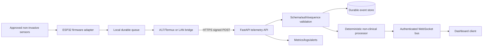

# Bio-Digital Telemetry Reference Blueprint

## Scope and safety boundary

This repository is a **production-oriented reference implementation for non-invasive telemetry ingestion, deterministic signal processing, and dashboard delivery**. It does not implement neural stimulation, direct cortical data upload, biological storage, medical diagnosis, treatment, high-voltage control, or autonomous intervention. Those capabilities remain outside scope and require separate scientific, clinical, regulatory, electrical, and human-subjects approvals.

“Production-ready” here means that the software boundary has explicit schemas, authentication, retries, idempotency, validation, observability points, and deployment controls. It does not mean that the physiological algorithms are clinically validated.

## Architecture



### Ownership boundaries

| Component | Owns | Must not own |
| --- | --- | --- |
| ESP32 | Sensor acquisition, calibration metadata, sequence, local queue, watchdog | Clinical interpretation or direct neural/high-voltage intervention |
| Mobile/LAN bridge | Transport adaptation, backoff, offline replay, device authentication | Silent data mutation or interpretation |
| FastAPI | Validation, authentication, idempotent ingestion, persistence, event publication | Claiming clinical meaning from raw signals |
| Processor | Versioned, deterministic, bounded feature calculations | Treatment decisions or unvalidated diagnostic scores |
| Dashboard | Visualisation, quality/status display, operator acknowledgement | Presenting simulation or stale data as LIVE |
| Operations | Secret rotation, deployment, observability, incident response | Bypassing validation for convenience |

## Protocol v1

### Ingress

`POST /v1/telemetry` over HTTPS. Required headers:

- `X-Device-ID`
- `X-Timestamp` — Unix seconds; maximum clock skew 300 seconds.
- `X-Nonce` — unique per request; replay window 300 seconds.
- `X-Signature` — HMAC-SHA256 over:

```text
METHOD\nPATH\nTIMESTAMP\nNONCE\nSHA256(BODY)
```

The body is the versioned telemetry envelope in `contracts/telemetry.schema.json`. Every envelope has a stable `message_id`; retries reuse the same message body and message ID but generate a fresh transport nonce. The API treats repeated message IDs as idempotent duplicates.

### Status codes

| Code | Meaning | Client action |
| --- | --- | --- |
| 202 | Accepted, stored, duplicate, or quarantined with an explicit acknowledgement body | Stop retrying unless action is transiently rejected by policy |
| 401 | Unknown device, stale timestamp, replayed nonce, or invalid signature | Do not retry blindly; correct credentials or clock |
| 403 | Device header does not match payload or not authorised | Stop and alert |
| 409 | Reserved for contract/version conflict | Correct payload or deployment |
| 422 | Schema or semantic validation failure | Correct producer; no retry |
| 429 | Rate limit | Retry with server-provided delay and bounded jitter |
| 500–599 | Server or dependency failure | Exponential backoff, bounded attempts, durable local queue |

### Retry algorithm

Use at most four attempts with delays of 250 ms, 500 ms, 1 s, and 2 s, capped by the deployment policy. Retry only network failures, 429, and 5xx responses. Do not retry 401, 403, 409, or 422. Preserve `message_id` and `sequence` across retries. A local queue must survive process restarts and must apply a maximum size and oldest-first discard policy with an auditable drop counter.

### WebSocket distribution

`GET /v1/ws` is an authenticated dashboard stream in the reference code. A production deployment should add client authentication, topic permissions, heartbeat/ping, reconnect with last-seen sequence, bounded queues, and replay from durable storage. The event envelope is:

```json
{
  "type": "dashboard.summary",
  "data": {
    "device_id": "esp32-s3-01",
    "last_sequence": 1842,
    "metrics": [],
    "generated_at": "2026-09-22T06:30:00Z"
  }
}
```

## Data processing model

The Python and JavaScript processors now use the same normalized `0..1` scale:

- `0` means the lower bound of the non-clinical display index.
- `1` means the upper bound of the non-clinical display index.
- The value is not a probability, diagnosis, or treatment recommendation.

A per-device exponentially weighted baseline is maintained for heart rate, respiratory rate, HRV, and alpha/beta relative power. Cognitive load is derived from the current beta/alpha ratio relative to baseline. Stress index combines bounded deviations in heart rate, respiratory rate, and HRV. Signal quality is the minimum reading quality across the envelope.

The algorithm is intentionally conservative and transparent. It is not clinically validated. Any clinical interpretation would require independent model development, calibration, uncertainty analysis, representative data, prospective validation, and qualified review.

## Development workflow

1. Create a virtual environment and install `requirements.txt`.
2. Run the Python test suite.
3. Start the API locally with `PYTHONPATH=. uvicorn backend.app.main:app --reload`.
4. Generate deterministic simulator envelopes from `simulations/python/simulator.py`.
5. Send envelopes only with `status=SIMULATED` until real sensor provenance and calibration are proven.
6. Review OpenAPI output and contract tests before changing schemas.
7. Use a migration note for every breaking schema change.

## Deployment blueprint

### Local or staging

Use `deploy/docker-compose.yml` with `DEVICE_KEYS` supplied through an uncommitted `.env` or secret injector. Enable TLS at a trusted reverse proxy. Do not expose the development server directly to the public internet.

### Production

Recommended components:

- FastAPI application behind a TLS reverse proxy or managed ingress.
- Durable relational or append-only event storage with retention policy.
- Redis, NATS, or an equivalent bounded event bus if WebSocket fan-out exceeds one process.
- Secret manager for device keys and dashboard credentials.
- Metrics endpoint and structured logs with correlation ID, device ID, sequence, and action.
- Backup, restore, and replay procedures.
- Separate development, staging, and production device credentials.
- Clock synchronisation on every gateway and device.
- Deployment gates requiring schema, replay, authentication, and rollback tests.

### Observability

Track ingestion rate, accepted/duplicate/quarantined/rejected counts, sequence gaps, timestamp skew, retry count, queue depth, WebSocket clients, processing latency, stale device age, and error rate. Never log raw secrets or unnecessary sensitive subject data.

## Hardware and firmware plan

The repository includes a typed C++ contract header only. A real ESP32 implementation must add:

- exact ESP32/S3 board and PCB revision;
- approved sensor list and wiring diagrams;
- GPIO, I2C, SPI, ADC, power, and ground map;
- calibration coefficients and calibration expiry;
- watchdog, brownout, OTA rollback, and secure-boot policy;
- local queue and loss accounting;
- monotonic sequence and UTC timestamp strategy;
- fault states for sensor disconnect, out-of-range values, and clock failure;
- electrical isolation and interlocks for any potentially hazardous field equipment.

The reference firmware boundary intentionally excludes plasma control and neural stimulation.

## Security model

HMAC is used in the reference implementation to make the protocol executable and testable. A production device fleet should use per-device keys stored in a secure element or protected keystore, automated rotation, revocation, least-privilege service accounts, TLS certificate validation, and an audited provisioning process. ML-DSA or another signature scheme may be added for offline evidence artifacts, but the signing boundary and key management must be specified before claiming authenticated telemetry.

## Release gates

A release is not production eligible until it passes:

- JSON Schema and Pydantic contract tests;
- authentication, stale-clock, invalid-signature, and replay tests;
- duplicate and out-of-order sequence tests;
- retry tests proving no duplicate logical ingestion;
- deterministic Python/JavaScript golden-vector comparison;
- load and backpressure tests;
- dependency and container scans;
- secret-leak checks;
- backup and restore rehearsal;
- hardware-in-loop tests with approved non-invasive sensors;
- safety review and data protection review.

## Known limitations of this reference

The store is in-memory, so process restart loses data. The WebSocket endpoint is intentionally minimal and does not yet authenticate dashboard clients. The HMAC key store is environment-backed rather than a managed secret vault. There is no database migration, rate limiter, metrics exporter, or full offline queue implementation. These are explicit production hardening tasks, not hidden claims of completeness.
